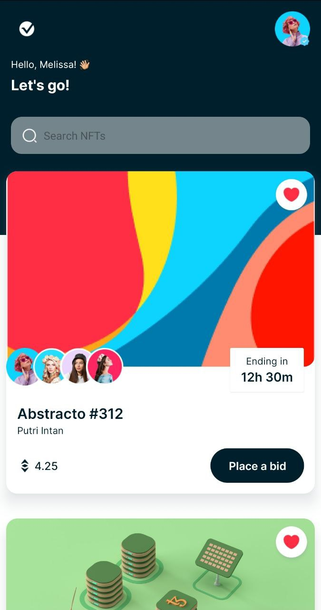
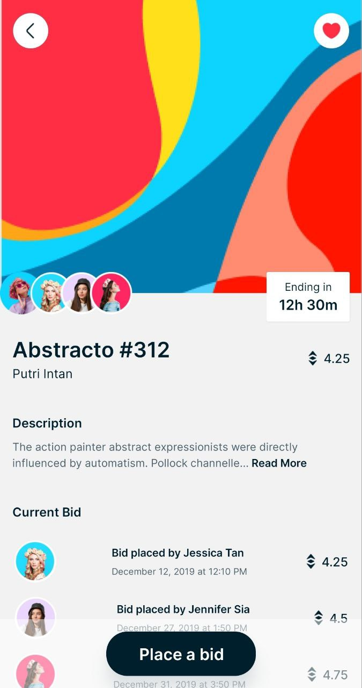

# JavaScript Project

## Description

This is a React Native project created with Expo. It's designed to provide a user-friendly interface for managing tasks.

## Images

  
  

## Installation

To install the project, follow these steps:

1. Clone the repository: `git clone https://github.com/username/repository.git`
2. Navigate to the project directory: `cd repository`
3. Install the dependencies: `npm install` or `yarn install`

## Usage

To run the project:

1. Start the development server: `npm start`.
2. Open the Expo client on your device and scan the QR code appearing in the terminal.

## Contributing

Contributions are welcome. Please fork the repository and create a pull request with your changes.
